<div align="center">
  
  <h1 align="center">Shadow Jury</h1>
  <p align="center">A 13-agent Mixture-of-Agents system that scores, critiques, and improves hackathon projects.</p>
  <p align="center">
    <a href="https://shadow-jury.onrender.com">Live Demo</a> ·
    <a href="#features">Features</a> ·
    <a href="#architecture">Architecture</a> ·
    <a href="#setup">Setup</a> ·
    <a href="#deployment">Deployment</a>
  </p>
  <p>
    
    
    
    
    
    
  </p>
</div>

---

## Overview

**Shadow Jury** is a multi-agent project evaluation platform built for hackathons. Upload your project files (or paste a README / link a GitHub repo), and a panel of **13 core AI agents** (plus 2 infrastructure helpers) across **4 layers** will:

- **Judge** your project across 5 criteria (Relevance, Reasoning, Creativity, UX, Safety)
- **Critique** with adversarial scrutiny, evidence verification, and competitive analysis
- **Synthesize** a weighted scorecard, narrative report, and actionable improvement suggestions
- **Export** as JSON, Markdown, or PDF with full agent deliberation included

Every agent runs with either **GPT-4o-mini** (via GitHub Models — free tier, 150 req/day) or a **rule-based fallback** when no API key is available.

---

## Features

| Feature | Details |
|---|---|
| **13 Agents, 4 Layers** | Intake → Judges → Critics → Synthesis |
| **LLM + Rule-Based Dual Mode** | GPT-4o-mini when `GITHUB_TOKEN` is set; deterministic rules otherwise |
| **Live Streaming Deliberation** | SSE-powered real-time agent thinking with per-agent reasoning toggles |
| **Foundry IQ Integration** | Azure AI Search indexes and retrieves grounded evidence |
| **GitHub Repo Fetching** | Auto-fetches up to 5 files from any public repo |
| **Scoring Rubric** | Weighted ensemble with confidence, penalties, and competition score |
| **Radar Chart** | Visual criteria breakdown via Chart.js |
| **Export Formats** | JSON, Markdown, PDF (via html2pdf.js + print fallback) |
| **Responsive UI** | Dark glassmorphism, animated aurora background, scroll-reveal animations |
| **Zero-Cost Deployment** | Render free tier + Azure AI Search free + GitHub Models free tier |

---

## Architecture

```mermaid
flowchart TB
    subgraph PreP["Pre-Pipeline (API Layer)"]
        GF[GitHub Fetcher<br/>fetches repo before pipeline starts]
    end

    subgraph Input["Input Layer (2 agents)"]
        FP[Doc Parser]
        CE[Claim Extractor]
        FI[Foundry IQ Indexer<br/>indexes docs into KB]
    end

    subgraph Judges["Judges Layer (5)"]
        RJ[Relevance Judge]
        RN[Reasoning Judge]
        CJ[Creativity Judge]
        UJ[UX Judge]
        SJ[Safety Judge]
        FQ[Foundry IQ Retriever<br/>fetches grounded evidence]
    end

    subgraph Critics["Critics Layer (3)"]
        DA[Devil's Advocate]
        EV[Evidence Verifier]
        CA[Competitive Analyst]
    end

    subgraph Synthesis["Synthesis Layer (3)"]
        SA[Scoring Aggregator]
        NB[Narrative Builder]
        RD[README Doctor]
    end

    PreP -.->|github_data parameter| Input
    Input --> Judges
    Judges --> Critics
    Critics --> Synthesis

    style PreP fill:#1a1a2e,stroke:#64748b
    style Input fill:#1a1a2e,stroke:#7c3aed
    style Judges fill:#1a1a2e,stroke:#7c3aed
    style Critics fill:#1a1a2e,stroke:#7c3aed
    style Synthesis fill:#1a1a2e,stroke:#7c3aed
```



### Agent Breakdown

**Layer 1 — Intake (2 agents + helpers)**
- `Document Parser` — Parses uploaded files into structured text chunks
- `Claim Extractor` — Extracts claims, features, goals from project materials
- `GitHub Fetcher` — Fetches repo contents via GitHub API (up to 5 files)

**Layer 2 — Judges (5 agents)**
| Judge | Evaluates |
|---|---|
| Relevance Judge | Fit to hackathon theme, problem-solution alignment, impact |
| Reasoning Judge | Technical depth, architectural soundness, logic |
| Creativity Judge | Novelty, innovation, differentiation |
| UX Judge | Accessibility, design, user experience |
| Safety Judge | Content safety, bias, responsible AI |

**Layer 3 — Critics (3 agents)**
- `Devil's Advocate` — Challenges assumptions, finds blind spots
- `Evidence Verifier` — Validates claims against indexed knowledge
- `Competitive Analyst` — Benchmarks against real hackathon winners

**Layer 4 — Synthesis (3 agents)**
- `Scoring Aggregator` — Weighted ensemble with confidence-based penalties
- `Narrative Builder` — Constructs executive summary, verdict, key actions
- `README Doctor` — Generates improvement suggestions for project docs

---

## Setup

### Prerequisites

- Python 3.11+
- (Optional) `GITHUB_TOKEN` — for GPT-4o-mini scoring via GitHub Models
- (Optional) Azure AI Search free tier — for Foundry IQ grounded evidence

### Local Development

```bash
git clone https://github.com/your-org/shadow-jury.git
cd shadow-jury

python -m venv venv
# Windows: venv\Scripts\activate
# Mac/Linux: source venv/bin/activate

pip install -r requirements.txt

# (Optional) Set env vars
# set GITHUB_TOKEN=ghp_...
# set SEARCH_ENDPOINT=https://....search.windows.net
# set SEARCH_API_KEY=...

uvicorn backend.main:app --reload --port 8000
```

Open `http://localhost:8000` in your browser.

### Environment Variables

| Variable | Required | Description |
|---|---|---|
| `GITHUB_TOKEN` | No | GitHub Personal Access Token (for LLM + repo fetching) |
| `SEARCH_ENDPOINT` | No | Azure AI Search endpoint URL |
| `SEARCH_API_KEY` | No | Azure AI Search admin API key |
| `PORT` | No | Server port (default: 8000) |

Without `GITHUB_TOKEN`, all agents fall back to rule-based evaluation. Without `SEARCH_*` keys, Foundry IQ evidence retrieval runs in mock mode.

---

## Deployment

### Render (Recommended)

The project includes `render.yaml` for one-click deploy:

1. Fork this repo
2. Create a new **Web Service** on Render
3. Connect your forked repo
4. Set:
   - **Build Command**: `pip install -r requirements.txt`
   - **Start Command**: `uvicorn backend.main:app --host 0.0.0.0 --port $PORT`
5. Add environment variables (optional)
6. Deploy

The frontend is served via a catch-all route from the same FastAPI process.

---

## Roadmap

- [x] 13-agent MoA pipeline with dual LLM/rule-based mode
- [x] GitHub Models integration (GPT-4o-mini)
- [x] Foundry IQ via Azure AI Search
- [x] Live deliberation streaming (SSE)
- [x] Radar chart (Chart.js)
- [x] Markdown export
- [x] PDF export with agent thinking
- [x] Responsive dark glassmorphism UI
- [x] Animated aurora background + noise texture


---

## Tech Stack

| Layer | Technology |
|---|---|
| Backend | Python, FastAPI, Pydantic |
| Frontend | HTML, Tailwind CSS, Vanilla JS, Chart.js |
| LLM | GitHub Models (GPT-4o-mini via Azure AI Inference) |
| Vector DB | Azure AI Search (Foundry IQ) |
| PDF | html2pdf.js + `window.print()` fallback |
| Deployment | Render (single process) |

---

## License

MIT License

---

<div align="center">
  <sub>Built with ❤️ for hackathon projects everywhere</sub>
</div>
