<div align="center">
  
  <h1 align="center">Shadow Jury</h1>
  <p align="center">A 13-agent Mixture-of-Agents system that scores, critiques, and improves hackathon projects.</p>
  <p align="center">
    <a href="https://shadow-jury.onrender.com">Live Demo</a> ·
    <a href="#features">Features</a> ·
    <a href="#architecture">Architecture</a> ·
    <a href="#setup">Setup</a> ·
    <a href="#deployment">Deployment</a>
  </p>
  <p>
    
    
    
    
    
    
  </p>
</div>

---

## Overview

**Shadow Jury** is a multi-agent project evaluation platform built for hackathons. Upload your project files (or paste a README / link a GitHub repo), and a panel of **13 core AI agents** across **4 layers** will:

- **Judge** your project across 5 weighted criteria (Relevance, Reasoning, Creativity, UX, Safety)
- **Critique** with adversarial scrutiny, evidence verification, and competitive analysis
- **Synthesize** a weighted scorecard, narrative report, and actionable improvement suggestions
- **Export** as JSON, Markdown, or PDF with full agent deliberation included

Every agent runs with either **GPT-4o-mini** (via GitHub Models — free tier, 150 req/day) or a **rule-based fallback** when no API key is available. The system uses **Foundry IQ (Azure AI Search)** for grounded evidence retrieval when configured.

---

## Features

| Feature | Details |
|---|---|
| **13 Agents, 4 Layers** | Intake (2) → Judges (5) → Critics (3) → Synthesis (3) |
| **LLM + Rule-Based Dual Mode** | GPT-4o-mini when `GITHUB_TOKEN` is set; deterministic rules otherwise |
| **Exponential Backoff Retry** | LLM calls retry up to 3 times with 2ⁿ-second delays |
| **Prompt Engineering** | Every judge has calibrated score bands, explicit JSON schema, and evidence injection |
| **Live Streaming Deliberation** | SSE-powered real-time agent thinking with per-agent reasoning toggles |
| **Foundry IQ Integration** | Azure AI Search indexes documents and retrieves grounded evidence for every judge |
| **GitHub Repo Fetching** | Auto-fetches up to 5 files from any public repo |
| **Scoring Rubric** | Weighted ensemble with confidence metrics, penalty caps (40% max), and 15% competition score blend |
| **Radar Chart** | Visual criteria breakdown via Chart.js v4 |
| **Export Formats** | JSON, Markdown, PDF (via html2pdf.js + print fallback) |
| **Responsive UI** | Dark/light glassmorphism themes, animated aurora, scroll-reveal, particle network |
| **Zero-Cost Deployment** | Render free tier + Azure AI Search free + GitHub Models free tier |

---

## Architecture

```mermaid
flowchart TB
    subgraph PreP["Pre-Pipeline (API Layer)"]
        GF[GitHub Fetcher<br/>fetches repo before pipeline starts]
    end

    subgraph Input["Intake Layer (2 agents)"]
        FP[Doc Parser]
        CE[Claim Extractor]
        FI[Foundry IQ Indexer<br/>indexes docs into KB]
    end

    subgraph Judges["Judges Layer (5)"]
        RJ[Relevance Judge<br/>prompt + evidence injected]
        RN[Reasoning Judge<br/>prompt + evidence injected]
        CJ[Creativity Judge<br/>prompt + evidence injected]
        UJ[UX Judge<br/>prompt + evidence injected]
        SJ[Safety Judge<br/>prompt + evidence injected]
        FQ[Foundry IQ Retriever<br/>retrieves grounded evidence]
    end

    subgraph Critics["Critics Layer (3)"]
        DA[Devil's Advocate]
        EV[Evidence Verifier<br/>cross-checks with KB]
        CA[Competitive Analyst]
    end

    subgraph Synthesis["Synthesis Layer (3)"]
        SA[Scoring Aggregator<br/>weighted + penalty + comp score]
        NB[Narrative Builder<br/>dynamic IQ summary]
        RD[README Doctor]
    end

    PreP -.->|github_data parameter| Input
    Input --> Judges
    Judges -->|evidence_dict with KB citations| Critics
    Judges -->|evidence_dict with KB citations| Synthesis
    Critics --> Synthesis

    style PreP fill:#1a1a2e,stroke:#64748b
    style Input fill:#1a1a2e,stroke:#7c3aed
    style Judges fill:#1a1a2e,stroke:#7c3aed
    style Critics fill:#1a1a2e,stroke:#7c3aed
    style Synthesis fill:#1a1a2e,stroke:#7c3aed
```



### Agent Breakdown

**Layer 1 — Intake (2 agents)**
- `Document Parser` — Parses uploaded files, detects title/description/claims/features/goals using regex patterns; chunks text by paragraph boundaries; detects tech stack from 40+ keywords with word-boundary matching
- `Claim Extractor` — Enriches claims list from features/goals; detects hackathon track from text

**Layer 2 — Judges (5 agents)**

Each judge has a calibrated 4-band scoring rubric, explicit JSON output schema, and Foundry IQ evidence injected into its prompt.

| Judge | Weight | Evaluates |
|---|---|---|
| Relevance Judge | 20% | Track alignment, claim-description consistency, tech stack fit |
| Reasoning Judge | 20% | Multi-step logic, agent orchestration, architecture clarity |
| Creativity Judge | 15% | Novelty, differentiation from common patterns, surprising elements |
| UX Judge | 15% | UI/UX strategy, demo readiness, documentation quality |
| Safety Judge | 20% | Security, ethical awareness, hallucination prevention, testing |

**Layer 3 — Critics (3 agents)**
- `Devil's Advocate` — Challenges claims with overpromise detection, scope creep analysis, missing documentation checks; applies penalty scores (0.25 for scores < 30, 0.15 for < 50)
- `Evidence Verifier` — Cross-checks judge justifications against citations; uses Foundry IQ KB evidence in both LLM and rule-based paths
- `Competitive Analyst` — Benchmarks against typical submissions; produces competition score (blended into final grade at 15%)

**Layer 4 — Synthesis (3 agents)**
- `Scoring Aggregator` — Weighted average with penalty cap at 40%; blends judge scores (85%) with competition score (15%)
- `Narrative Builder` — Constructs executive summary, verdict, and dynamic Foundry IQ status (active/not configured)
- `README Doctor` — Detects missing sections, track declaration issues, demo readiness; generates actionable suggestions

---

## Setup

### Prerequisites

- Python 3.11+
- (Optional) `GITHUB_TOKEN` — for GPT-4o-mini scoring via GitHub Models
- (Optional) Azure AI Search free tier — for Foundry IQ grounded evidence

### Local Development

```bash
git clone https://github.com/your-org/shadow-jury.git
cd shadow-jury

python -m venv venv
# Windows: venv\Scripts\activate
# Mac/Linux: source venv/bin/activate

pip install -r requirements.txt

# (Optional) Set env vars
# set GITHUB_TOKEN=ghp_...
# set SEARCH_ENDPOINT=https://....search.windows.net
# set SEARCH_API_KEY=...

uvicorn backend.main:app --reload --port 8000
```

Open `http://localhost:8000` in your browser.

### Environment Variables

| Variable | Required | Description |
|---|---|---|
| `GITHUB_TOKEN` | No | GitHub Personal Access Token (for LLM + repo fetching) |
| `SEARCH_ENDPOINT` | No | Azure AI Search endpoint URL |
| `SEARCH_API_KEY` | No | Azure AI Search admin API key |
| `PORT` | No | Server port (default: 8000) |

Without `GITHUB_TOKEN`, all agents fall back to rule-based evaluation. Without `SEARCH_*` keys, Foundry IQ evidence retrieval runs in mock mode.

---

## Data Flow

1. **Upload** — Files/README/GitHub URL → `POST /api/upload` returns `pipeline_id`
2. **Intake** — `DocParser` chunks text → `ClaimExtractor` enriches claims → `DocumentIndexer` indexes into Azure AI Search
3. **Judging** — `FoundryIQClient` retrieves relevant KB passages → All 5 judges receive evidence-injected LLM prompts → Scores with justifications and citations
4. **Critique** — `DevilsAdvocate` identifies weaknesses + penalties → `EvidenceVerifier` cross-checks citations including KB evidence → `CompetitiveAnalyst` benchmarks
5. **Synthesis** — `ScoringAggregator` computes weighted score + competition blend → `NarrativeBuilder` writes summary → `README Doctor` generates suggestions
6. **Output** — Final report cached on pipeline object; accessible via `/api/report/{id}` and `/api/download/{id}` without re-running

---

## Deployment

### Render (Recommended)

The project includes `render.yaml` for one-click deploy:

1. Fork this repo
2. Create a new **Web Service** on Render
3. Connect your forked repo
4. Set:
   - **Build Command**: `pip install -r requirements.txt`
   - **Start Command**: `uvicorn backend.main:app --host 0.0.0.0 --port $PORT`
5. Add environment variables (optional):
   - `GITHUB_TOKEN` — enables GPT-4o-mini scoring
   - `SEARCH_ENDPOINT` + `SEARCH_API_KEY` — enables Foundry IQ retrieval
6. Deploy

The frontend is served via a catch-all route from the same FastAPI process.

---

## Roadmap

- [x] 13-agent MoA pipeline with dual LLM/rule-based mode
- [x] GitHub Models integration (GPT-4o-mini)
- [x] Foundry IQ via Azure AI Search with per-judge evidence injection
- [x] Live deliberation streaming (SSE, 37 events)
- [x] Calibrated judge prompts with score bands and JSON schema
- [x] Exponential backoff retry for LLM calls (3 attempts)
- [x] Pydantic v2 model_validate for robust parsing
- [x] Semantic paragraph chunking for document indexing
- [x] Cached report endpoints (no pipeline re-run on GET)
- [x] Logged exception handling (no silent failures)
- [x] Competition score blended into final grade (15%)
- [x] Dynamic Foundry IQ status in narrative output
- [x] Radar chart (Chart.js v4)
- [x] Markdown export + PDF export with agent thinking
- [x] Responsive dark/light glassmorphism UI
- [x] Animated aurora background + particle network

---

## Tech Stack

| Layer | Technology |
|---|---|
| Backend | Python 3.11+, FastAPI, Pydantic v2, httpx |
| Frontend | HTML, Tailwind CSS (CDN), Vanilla JS, Chart.js v4 |
| LLM | GitHub Models (GPT-4o-mini via Azure AI Inference) |
| Vector DB | Azure AI Search (Foundry IQ, free tier) |
| PDF | html2pdf.js + `window.print()` fallback |
| Deployment | Render (single process, free tier) |
| Auth | CORS locked to production + localhost origins |

---

## License

MIT License

---

<div align="center">
  <sub>Built with ❤️ for hackathon projects everywhere</sub>
</div>
